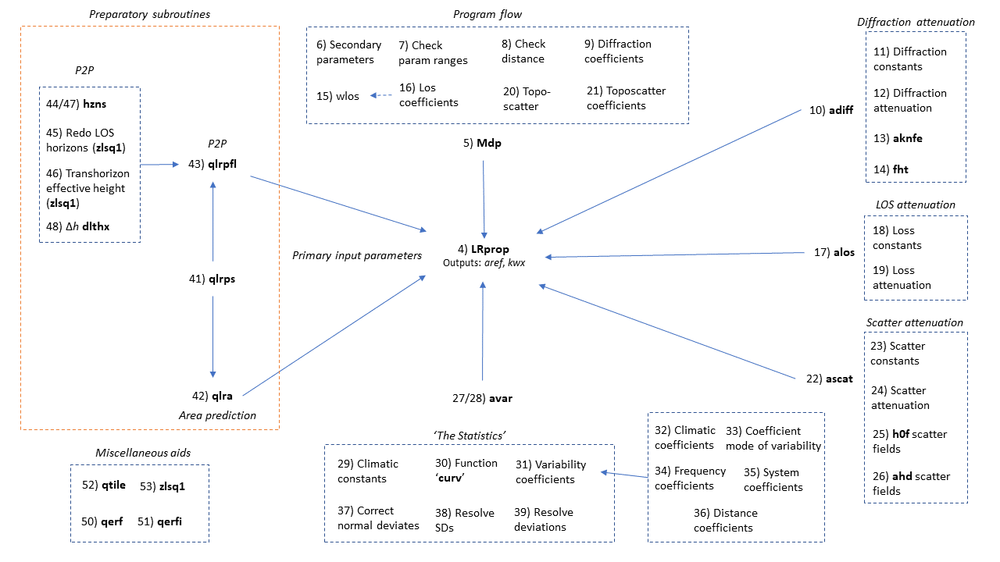

# Summary

Billions of people still do not have access to a reliable internet connection. One of the most effective ways to provide wide area access to a disparate user base is via wireless radio technologies, such as cellular 4G or 5G. The costs of wireless deployment are considerably lower than fixed alternatives, which is beneficial in areas with low per-capita income or adoption.

Data science methods can help us to more accurately identify unconnected groups and help to design least-cost internet access strategies. However, many of the statistical tools in the field are written in Python and therefore there is a language conflict with classic propagation models which have not yet been made available in this programming language.

The Longley Rice Irregular Terrain Model is a classic propagation model developed by the Central Radio Propagation Laboratory during the 1960s in Colorado, USA, by A.G. Longley and P.L. Rice. The model is still widely used throughout the cellular industry by Mobile Network Operators (MNOs) as it can predict long-term median transmission loss over irregular terrain. The original open-source model is available in Fortran or C++ [@ITS:2007].

This paper describes the ``itmlogic`` package, which provides a Python implementation of the Longley Rice Irregular Terrain Model. It implements the classic model, enabling the quantification of propagation loss over irregular terrain. ``itmlogic`` is capable of predicting the the statistics of propagation loss given input parameters such as transmitter and receiver heights, frequency, surface permittivity, climate zone, and terrain information.

## Statement of Need

Smaller Mobile Network Operators may not have their own in-house engineering models. While other software packages are available, they need to be commercially licensed. Hence, this open-source package can help keep costs low for MNOs working to connect communities in rural and remote regions where costs are high and returns low.

## Uniqueness

The Longley-Rice model provides desirable features for a propagation model by predicting propagation loss given user parameters including information on the cumulative distribution function of the predicted loss so that the user can predict system performance as a function of reliability.

## Spatial Units

Inputs to the model are in the MKS system of units, so that the transmitter and receiver heights above the local terrain are specified in meters while ranges are specified in kilometers. Information on the terrain profile between transmitter and receiver is specified using a terrain profile with heights above sea level in meters. Information on expected atmospheric refractivity properties can also be input so that refractive effects are taken into account through the use of a modified Earth radius.

## The Longley-Rice Model

The model's purpose is to predict properties of the propagation loss in a communications link between a transmitter and receiver. The predicted propagation loss is described using cumulative distributions given the stochastic nature of radio wave propagation. The model originally was created in the 1960s when television broadcasting and terrestrial radio were important systems that required better engineering [@Hufford:1982]. The model is based on empirical curve fits to an extensive set of propagation measurements performed by the Institution for Telecommunication Sciences and other organizations.

Two modes of prediction are available: "area prediction" and "point-to-point". Area prediction mode uses a terrain irregularity parameter based on the inter-decile range of terrain elevations (the range after removing the top 10% and bottom 10% of elevations). Point-to-point mode uses a sample of up to 600 points from the terrain profile of the straight line between transmitter and receiver [@Hufford:1995].

## Applications

The median propagation loss estimates produced by ``itmlogic`` can be used with other link budget estimation models to assess the capacity, coverage and cost of 5G infrastructure. For example, this could include application via the path loss module of the Python Simulator for Integrated Modelling of 5G, ``pysim5G`` [@Oughton:2019b].

## Acknowledgements

We would like to acknowledge the funding which has enabled development of itmlogic, from the EPSRC via (i) the Infrastructure Transitions Research Consortium Mistral project (EP/N017064/1) and (ii) Facebook Connectivity Lab's Rural Connectivity program.

# References
